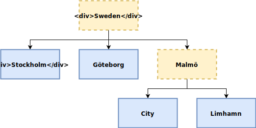
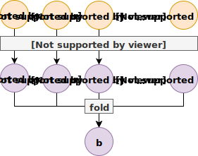
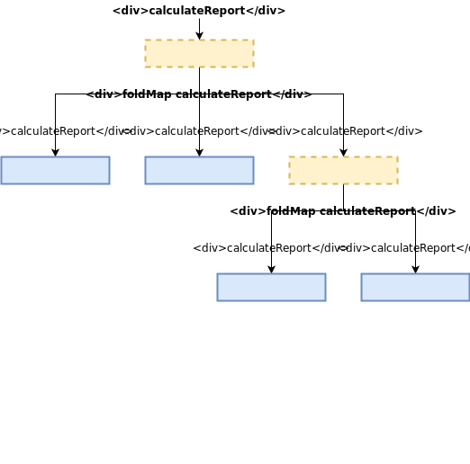

## Domain Modeling

* Capturing selected aspects of a problem domain
  - Data
  - Behavior
* Clear and unambiguous naming
* Separate bounded contexts
* Reify the domain in our code

## Haskell

* All the flexibility we need
    - Sum types
    - Product types
    - Type classes
* Powerful type system
    - Guides your implementation
    - Maintainable code
* Mature compiler (GHC) and ecosystem

## Modeling in Haskell

* Goal: domain model should be reified with data types
* Separation with data types:
    - Separate bounded contexts using different data types
    - Define explicit interfaces and translations between them
* Structure computation as data structures

## Modeling in Haskell (cont.)

* Use modules for cohesive units
    - Domain logic, repositories/data access, rendering
    - Capture interfaces and responsibilities using data types and
      type classes
    - Avoid the `Types.hs` trap
* Leverage all the lovely abstractions

## Type-Driven Development

* "Type, define, refine"
* When modifying existing code:
    - Change to data types to model the new behavior
    - Fix all the type errors
    - Test, and possibly refine your model
* Great for changing business requirements
* Focus testing on behavior

# Haskell Refresher

## Product Types

```{.haskell include=src/listings/intro/src/Intro.hs snippet=product-type-1}
```

## Sum Types

```{.haskell include=src/listings/intro/src/Intro.hs snippet=sum-type-1}
```

## Functions

```{.haskell include=src/listings/intro/src/Intro.hs snippet=function-1}
```

## Pattern Matching

```{.haskell include=src/listings/intro/src/Intro.hs snippet=pattern-matching}
```

## Nested Data

```{.haskell include=src/listings/intro/src/Intro.hs snippet=nested-data}
```

## Effects

```{.haskell include=src/listings/intro/src/Intro.hs snippet=effects}
```

## All Together, Now!

```{.shell}
> let me = Customer "Oskar" "Wickström"
> let order = airlineStyleOrder me OvoLacto
> printOrder order
Oskar Wickström ordering Omelette.
```


# Example: Project Management System

## Project Management

* A simple project management system
    - Hierarchy of projects
    - Budgets
    - Transactions
    - Reports
* Not terribly exciting, but relatable
* We'll explore:
    - Data types
    - Some very useful abstractions

## Project Tree

{width=100%}

## Project Data Type

``` {.haskell include=src/listings/data-structures/src/Project.hs snippet=project}
```

## Project in UML

{width=50%}

## Budget

``` {.haskell include=src/listings/data-structures/src/Project.hs snippet=budget}
```

## Transaction

``` {.haskell include=src/listings/data-structures/src/Project.hs snippet=transaction}
```

## Reporting

``` {.haskell include=src/listings/data-structures/src/Reporting.hs snippet=report}
```

## Calculating a Report{transition=none}

``` {.haskell include=src/listings/data-structures/src/Reporting.hs snippet=calculateReport emphasize=1-1}
```

## Calculating a Report{transition=none}

``` {.haskell include=src/listings/data-structures/src/Reporting.hs snippet=calculateReport emphasize=2:39-6:3}
```

## Calculating a Report{transition=none}

``` {.haskell include=src/listings/data-structures/src/Reporting.hs snippet=calculateReport emphasize=8-8}
```

## Calculating a Report{transition=none}

``` {.haskell include=src/listings/data-structures/src/Reporting.hs snippet=calculateReport emphasize=9-9}
```

## Calculating a Report{transition=none}

``` {.haskell include=src/listings/data-structures/src/Reporting.hs snippet=calculateReport emphasize=10-11}
```

## Recursively Calculating Reports

``` {.haskell include=src/listings/data-structures/src/Reporting.hs snippet=calculateProjectReport emphasize=1-1}
```

## Recursively Calculating Reports{transition=none}

``` {.haskell include=src/listings/data-structures/src/Reporting.hs snippet=calculateProjectReport emphasize=4-7}
```

## Recursively Calculating Reports{transition=none}

``` {.haskell include=src/listings/data-structures/src/Reporting.hs snippet=calculateProjectReport emphasize=8-9}
```

## Requirements for foldMap

* Semigroup (associative operation)

    ```haskell
    class Semigroup a where
      (<>) :: a -> a -> a
    ```

* Monoid (Semigroup with identity element)

    ```haskell
    class Semigroup a => Monoid a where
      mempty  :: a
    ```

## Semigroup and Monoid for Report

``` {.haskell include=src/listings/data-structures/src/Reporting.hs snippet=semigroup-monoid}
```

## FoldMap

```shell
> :type foldMap
foldMap :: (Foldable t, Monoid m) => (a -> m) -> t a -> m
```

## foldMap

{width=60%}

## Recursive foldMap

{width=100%}

## Printing Projects

``` {.haskell include=src/listings/data-structures/src/PrettyPrint.hs snippet=tree emphasize=1-1}
```

## Printing Projects{transition=none}

``` {.haskell include=src/listings/data-structures/src/PrettyPrint.hs snippet=tree emphasize=4-5}
```

## Printing Projects{transition=none}

``` {.haskell include=src/listings/data-structures/src/PrettyPrint.hs snippet=tree emphasize=6-7}
```

## Defining a Project

``` {.haskell include=src/listings/data-structures/src/Demo.hs snippet=someProject}
```

## Printing Projects in the REPL

```{.shell}
> putStrLn (prettyProject someProject)
Sweden
|
+- Stockholm (1)
|
+- Göteborg (2)
|
`- Malmö
   |
   +- Malmö City (3)
   |
   `- Limhamn (4)
```

## Printing Reports

``` {.haskell include=src/listings/data-structures/src/PrettyPrint.hs snippet=prettyReport}
```

## Printing Reports in the REPL

```{.shell}
> r <- calculateProjectReport someProject
> putStrLn (prettyReport r)
Budget: -14904.17, Net: 458.03, difference: +15362.20
```

## What we've used so far

* Basic Haskell data types
* Explicit recursion
* Monoid
* Functor
* Foldable

# New Requirements!

## A Tree Of Reports

* One big report for the entire project is not enough
* The customer needs them for all individual projects

## Parameterizing Project

``` {.haskell include=src/listings/foldable-traversable/src/Project.hs snippet=project}
```

## Calculating Project Reports with Traversable

``` {.haskell include=src/listings/foldable-traversable/src/Reporting.hs snippet=calculateProjectReports}
```

## Traversable

TODO

## Traversable

TODO: Graphics

## Accumulating Reports with Foldable

``` {.haskell include=src/listings/foldable-traversable/src/Reporting.hs snippet=accumulateProjectReport}
```

## Adapting the Pretty Printing

``` {.haskell include=src/listings/foldable-traversable/src/PrettyPrint.hs snippet=pretty-printing}
```

## Pretty Printing the Reports

```shell
> pr <- calculateProjectReports someProject
> putStrLn (prettyProject prettyReport pr)
Sweden
|
+- Stockholm: Budget: -2259.99, Net: 391.23, difference: +2651.22
|
+- Göteborg: Budget: -3204.79, Net: -228.31, difference: +2976.48
|
`- Malmö
   |
   +- Malmö City: Budget: -6958.82, Net: 2811.88, difference: +9770.70
   |
   `- Limhamn: Budget: 5856.93, Net: 1941.43, difference: -3915.50
```

## Pretty Printing the Reports (cont.)

```shell
> putStrLn (prettyReport (accumulateProjectReport pr))
Budget: -6566.67, Net: 4916.23, difference: +11482.90
```

## What we've added to our toolbox

* Parameterized Data Type
* Traversable

# "No, that's not what we want."

## Actual Requirements

* The customer wants reporting on *all* levels:
    - project groups
    - single projects
* We need to change our model again

## Parameterizing Project Even More

``` {.haskell include=src/listings/writert/src/Project.hs snippet=project}
```

## Calculating Reports with WriterT

``` {.haskell include=src/listings/writert/src/Reporting.hs snippet=calculateProjectReports}
```

``` {.haskell}
    -- ...
```

## For A Single Project

``` {.haskell include=src/listings/writert/src/Reporting.hs snippet=calculateProjectReports-single}
```

## For a Project Group

``` {.haskell include=src/listings/writert/src/Reporting.hs snippet=calculateProjectReports-group}
```

## Adapting the Pretty Printing

``` {.haskell include=src/listings/writert/src/PrettyPrint.hs snippet=asTree}
```

``` {.haskell include=src/listings/writert/src/PrettyPrint.hs snippet=prettyProject}
```

## Pretty Printing the Reports

```shell
> pr <- calculateProjectReports someProject
> putStrLn (prettyProject prettyReport prettyReport pr)
Sweden: Budget: -9278.10, Net: +4651.81, difference: +13929.91
|
+- Stockholm: Budget: -3313.83, Net: -805.37, difference: +2508.46
|
+- Göteborg: Budget: -422.48, Net: +1479.00, difference: +1901.48
|
`- Malmö: Budget: -5541.79, Net: +3978.18, difference: +9519.97
   |
   +- Malmö City: Budget: -4069.45, Net: +2185.02, difference: +6254.47
   |
   `- Limhamn: Budget: -1472.34, Net: +1793.16, difference: +3265.50
```

## Even More Learnings

* Explicit recursion might still be necessary
* The Writer monad transformer
* There are many ways to leverage Monoid

## Explicit Recursion

* Explicit recursion can, with large data types, be error-prone
* Current `Project` type has a hidden coupling to the reporting module
    - The `g` and `a` parameters are only there for reporting
* Recursion schemes is an *advanced* option

## What we haven't covered

TODO!

## Summary

* Use Haskell data types
    - As the basis of your domain model
    - To structure computation
* Leverage great abstractions
    - Functor
    - Monoid
    - Foldable
    - Traversable
    - and many more
* Enjoy evolving and refactoring existing code

# Thank You!
