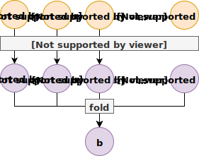
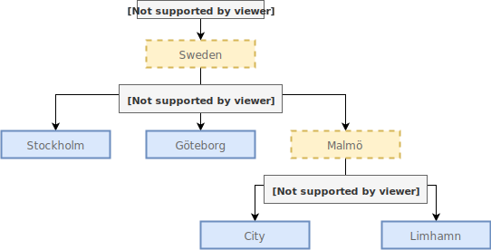

## Introduction

{width=30% .float-right}

* I work at Symbiont
  - Remote
  - Haskell
* Long-standing interest in DDD
* Applying Haskell since early days

# Domain Modeling & Haskell

## Domain Modeling

* Capturing selected aspects of a problem domain
  - Data
  - Behavior
* Clear and unambiguous naming
* Separate bounded contexts
* Reify the domain in our code

## Haskell

* All the flexibility we need
    - Sum types
    - Product types
    - Type classes
* Powerful type system
    - Guides your implementation
    - Maintainable code
* Mature compiler (GHC) and ecosystem

## Modeling in Haskell

* Express the domain model using data types
* Structure computation as data structures
* "Type-Driven Development"
    - Change to data types to model the new behavior
    - Fix all the type errors
    - Test, and possibly refine your model

## Agenda

* Basics of Haskell language
* Larger example
  - Data types
  - Functions
  - Effects
  - Common abstractions
* Scratching the surface!

# Haskell Refresher

## Product Types

```{.haskell include=src/listings/intro/src/Intro.hs snippet=product-type-1}
```

## Sum Types

```{.haskell include=src/listings/intro/src/Intro.hs snippet=sum-type-1}
```

## Functions

```{.haskell include=src/listings/intro/src/Intro.hs snippet=function-1}
```

## Pattern Matching

```{.haskell include=src/listings/intro/src/Intro.hs snippet=pattern-matching}
```

## Nested Data

```{.haskell include=src/listings/intro/src/Intro.hs snippet=nested-data}
```

## Effects

```{.haskell include=src/listings/intro/src/Intro.hs snippet=effects}
```

## All Together, Now!

```{.shell}
> let me = Customer "Oskar" "Wickström"
> let order = airlineStyleOrder me OvoLacto
> printOrder order
Oskar Wickström ordering Omelette.
```

## Functor

```{.haskell include=src/listings/intro/src/Functor.hs snippet=functor}
```

## Functor for Maybe

* A `Functor` instance for `Maybe`:

  ```{.haskell include=src/listings/intro/src/Functor.hs snippet=maybe}
  ```

* We can then `fmap` functions over `Maybe` values:

  ```haskell
  fmap (+1) (Just 10)  -- Just 11
  fmap (+1) Nothing    -- Nothing
  ```

## Functor for IO

```{.haskell include=src/listings/intro/src/IOFunctor.hs snippet=io-functor}
```

# Example: Project Management System

## Project Management

* A simple project management system
    - Hierarchy of projects
    - Budgets
    - Transactions
    - Reports
* Not terribly exciting, but relatable
* We'll explore:
    - Data types
    - Some very useful abstractions

## Project Tree

{width=100%}

## Project Data Type

``` {.haskell include=src/listings/data-structures/src/Project.hs snippet=project}
```

## Budget

``` {.haskell include=src/listings/data-structures/src/Project.hs snippet=budget}
```

## Transaction

``` {.haskell include=src/listings/data-structures/src/Project.hs snippet=transaction}
```

## Reporting

``` {.haskell include=src/listings/data-structures/src/Reporting.hs snippet=report}
```

## Calculating a Report{transition=none}

``` {.haskell include=src/listings/data-structures/src/Reporting.hs snippet=calculateReport emphasize=1-1}
```

## Calculating a Report{transition=none}

``` {.haskell include=src/listings/data-structures/src/Reporting.hs snippet=calculateReport emphasize=2:39-6:3}
```

## Calculating a Report{transition=none}

``` {.haskell include=src/listings/data-structures/src/Reporting.hs snippet=calculateReport emphasize=8-8}
```

## Calculating a Report{transition=none}

``` {.haskell include=src/listings/data-structures/src/Reporting.hs snippet=calculateReport emphasize=9-9}
```

## Calculating a Report{transition=none}

``` {.haskell include=src/listings/data-structures/src/Reporting.hs snippet=calculateReport emphasize=10-11}
```

## Recursively Calculating Reports

``` {.haskell include=src/listings/data-structures/src/Reporting.hs snippet=calculateProjectReport emphasize=1-1}
```

## Recursively Calculating Reports{transition=none}

``` {.haskell include=src/listings/data-structures/src/Reporting.hs snippet=calculateProjectReport emphasize=4-7}
```

## Recursively Calculating Reports{transition=none}

``` {.haskell include=src/listings/data-structures/src/Reporting.hs snippet=calculateProjectReport emphasize=8-9}
```

## Requirements for foldMap{.side-track}

* Semigroup (associative binary operation)

    ```haskell
    class Semigroup a where
      (<>) :: a -> a -> a
    ```

* Monoid (Semigroup with identity element)

    ```haskell
    class Semigroup a => Monoid a where
      mempty  :: a
    ```

## Semigroup and Monoid for Report

``` {.haskell include=src/listings/data-structures/src/Reporting.hs snippet=semigroup-monoid}
```

## foldMap{.side-track}

```{.haskell emphasize=3:6-3:99}
foldMap
  :: (Foldable f, Monoid b)
  => (a -> b)
  -> f a
  -> b
```

## foldMap{.side-track transition=none}

```{.haskell emphasize=4:6-4:99}
foldMap
  :: (Foldable f, Monoid b)
  => (a -> b)
  -> f a
  -> b
```

## foldMap{.side-track transition=none}

```{.haskell emphasize=5:6-5:99}
foldMap
  :: (Foldable f, Monoid b)
  => (a -> b)
  -> f a
  -> b
```

## foldMap on Lists{.side-track}

{width=60%}

## Recursive foldMap

{width=100%}

## Printing Projects

``` {.haskell include=src/listings/data-structures/src/PrettyPrint.hs snippet=tree emphasize=1-1}
```

## Printing Projects{transition=none}

``` {.haskell include=src/listings/data-structures/src/PrettyPrint.hs snippet=tree emphasize=4-5}
```

## Printing Projects{transition=none}

``` {.haskell include=src/listings/data-structures/src/PrettyPrint.hs snippet=tree emphasize=6-7}
```

## Defining a Project

``` {.haskell include=src/listings/data-structures/src/Demo.hs snippet=someProject}
```

## Printing Projects in the REPL

```{.shell}
> putStrLn (prettyProject someProject)
Sweden
|
+- Stockholm (1)
|
+- Göteborg (2)
|
`- Malmö
   |
   +- Malmö City (3)
   |
   `- Limhamn (4)
```

## Printing Reports

``` {.haskell include=src/listings/data-structures/src/PrettyPrint.hs snippet=prettyReport}
```

## Printing Reports in the REPL

```{.shell}
> r <- calculateProjectReport someProject
> putStrLn (prettyReport r)
Budget: -14904.17, Net: 458.03, difference: +15362.20
```

## What we've used so far

* Basic Haskell data types
* Explicit recursion
* Monoid
* Functor
* Foldable

# New Requirements!

## A Tree Of Reports

* One big report for the entire project is not enough
* The customer needs them for all individual projects

## Parameterizing Project

``` {.haskell include=src/listings/foldable-traversable/src/Project.hs snippet=project emphasize=1:14-1:14,3:19-3:19,5:27-5:27}
```

## Parameterizing Project{transition=none}

``` {.haskell include=src/listings/foldable-traversable/src/Project.hs snippet=project emphasize=6:32-6:52}
```

## Traversable{.side-track transition=none}

```{.haskell emphasize=3:6-3:15}
traverse
  :: (Traversable t, Applicative f)
  => (a -> f b)
  -> t a
  -> f (t b)
```

## Traversable{.side-track transition=none}

```{.haskell emphasize=4:6-4:9}
traverse
  :: (Traversable t, Applicative f)
  => (a -> f b)
  -> t a
  -> f (t b)
```

## Traversable{.side-track transition=none}

```{.haskell emphasize=5:6-5:12}
traverse
  :: (Traversable t, Applicative f)
  => (a -> f b)
  -> t a
  -> f (t b)
```

## Example of Traversable{.side-track}

```haskell
getDescription :: ProjectId -> IO Text

myProject :: Project ProjectId

example :: IO (Project Text)
example = traverse getDescription myProject
```


## Calculating Reports with Traversable

``` {.haskell include=src/listings/foldable-traversable/src/Reporting.hs snippet=calculateProjectReports emphasize=2:6-3:99}
```

## Calculating Reports with Traversable{transition=none}

``` {.haskell include=src/listings/foldable-traversable/src/Reporting.hs snippet=calculateProjectReports emphasize=5-8}
```

## Accumulating Reports with Foldable

``` {.haskell include=src/listings/foldable-traversable/src/Reporting.hs snippet=accumulateProjectReport}
```

## Adapting the Pretty Printing

``` {.haskell include=src/listings/foldable-traversable/src/PrettyPrint.hs snippet=pretty-printing}
```

## Pretty Printing the Reports

```shell
> pr <- calculateProjectReports someProject
> putStrLn (prettyProject prettyReport pr)
Sweden
|
+- Stockholm: Budget: -2259.99, Net: 391.23, difference: +2651.22
|
+- Göteborg: Budget: -3204.79, Net: -228.31, difference: +2976.48
|
`- Malmö
   |
   +- Malmö City: Budget: -6958.82, Net: 2811.88, difference: +9770.70
   |
   `- Limhamn: Budget: 5856.93, Net: 1941.43, difference: -3915.50
```

## Pretty Printing the Reports (cont.)

```shell
> putStrLn (prettyReport (accumulateProjectReport pr))
Budget: -6566.67, Net: 4916.23, difference: +11482.90
```

## What we've added to our toolbox

* Parameterized Data Type
* Traversable

# "No, that's not what we want."

## Actual Requirements

* The customer wants reporting on *all* levels:
    - project groups
    - single projects
* We need to change our model again

## Parameterizing Project Even More

``` {.haskell include=src/listings/writert/src/Project.hs snippet=project emphasize=1:14-1:14,5:18-5:18,6:27-6:27}
```

## Calculating Reports with WriterT

``` {.haskell include=src/listings/writert/src/Reporting.hs snippet=calculateProjectReports emphasize=2:6-3:31}
```

``` {.haskell}
    -- ...
```

## Calculating Reports with WriterT{transition=none}

``` {.haskell include=src/listings/writert/src/Reporting.hs snippet=calculateProjectReports emphasize=5:11-5:35}
```

``` {.haskell}
    -- ...
```

## For A Single Project

``` {.haskell include=src/listings/writert/src/Reporting.hs snippet=calculateProjectReports-single emphasize=2-5}
```

## For A Single Project{transition=none}

``` {.haskell include=src/listings/writert/src/Reporting.hs snippet=calculateProjectReports-single emphasize=6-6}
```

## For A Single Project{transition=none}

``` {.haskell include=src/listings/writert/src/Reporting.hs snippet=calculateProjectReports-single emphasize=7-7}
```

## For a Project Group

``` {.haskell include=src/listings/writert/src/Reporting.hs snippet=calculateProjectReports-group emphasize=2:7-2:99}
```

## Adapting the Pretty Printing

``` {.haskell include=src/listings/writert/src/PrettyPrint.hs snippet=asTree}
```

``` {.haskell include=src/listings/writert/src/PrettyPrint.hs snippet=prettyProject}
```

## Pretty Printing the Reports

```shell
> pr <- calculateProjectReports someProject
> putStrLn (prettyProject prettyReport prettyReport pr)
Sweden: Budget: -9278.10, Net: +4651.81, difference: +13929.91
|
+- Stockholm: Budget: -3313.83, Net: -805.37, difference: +2508.46
|
+- Göteborg: Budget: -422.48, Net: +1479.00, difference: +1901.48
|
`- Malmö: Budget: -5541.79, Net: +3978.18, difference: +9519.97
   |
   +- Malmö City: Budget: -4069.45, Net: +2185.02, difference: +6254.47
   |
   `- Limhamn: Budget: -1472.34, Net: +1793.16, difference: +3265.50
```

## Even More Learnings

* Explicit recursion might still be necessary
* The `WriterT` monad transformer
* There are many ways to leverage `Monoid`

## Remaining Issues

* Explicit recursion can, with large data types, be error-prone
* Current `Project` type has a hidden coupling to the reporting module
    - The `g` and `a` parameters are only there for reporting
* Recursion schemes is an *advanced* solution

# Summary

## What we haven't covered

* Writes
* Cyclic references
* Complex database queries
* Pretty front-end

## Domain Modeling in Haskell

* Use Haskell data types
    - As the basis of your domain model
    - To structure computation
* Leverage great abstractions
    - Functor
    - Semigroup
    - Monoid
    - Foldable
    - Traversable
* Enjoy evolving and refactoring existing code

## Next Steps

* [Haskell at Work](https://haskell-at-work.com/) screencasts:
  - [Data Structures](https://haskell-at-work.com/episodes/2018-01-19-domain-modelling-with-haskell-data-structures.html)
  - [Generalizing with Foldable and Traversable](https://haskell-at-work.com/episodes/2018-01-22-domain-modelling-with-haskell-generalizing-with-foldable-and-traversable.html)
  - [Accumulating with WriterT](https://haskell-at-work.com/episodes/2018-02-02-domain-modelling-with-haskell-accumulating-with-writert.html)
  - [Factoring Out Recursion](https://haskell-at-work.com/episodes/2018-02-11-domain-modelling-with-haskell-factoring-out-recursion.html)
* [Type Classes (online Haskell courses)](https://typeclasses.com/)

# Thank You!
